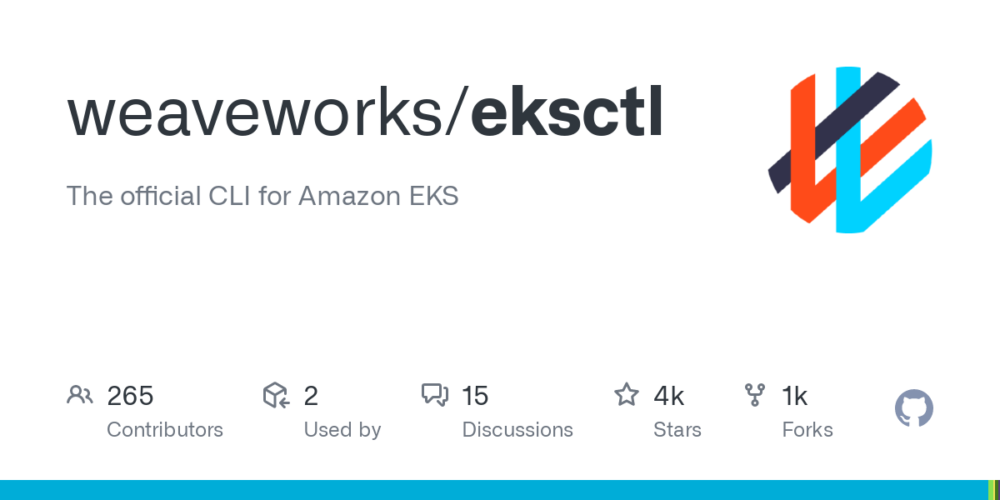
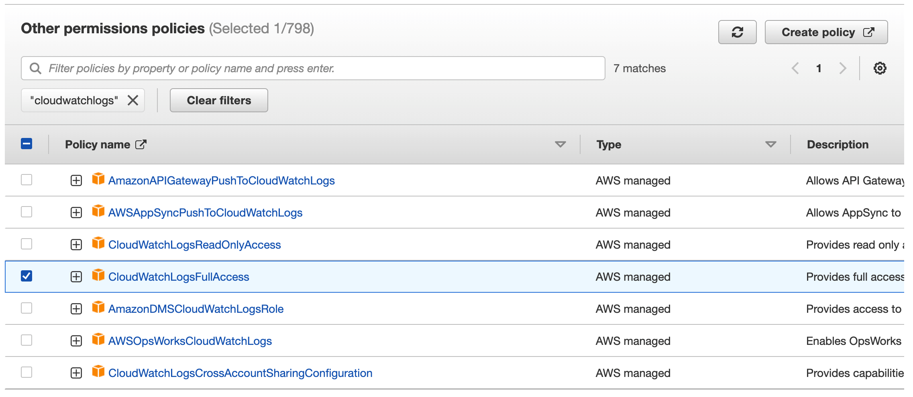

## Deploy an EKS cluster using eksctl and view monitoring insights on CloudWatch.

---

#### What is eksctl?

eksctl is a simple CLI tool for creating and managing clusters on EKS - Amazon's managed Kubernetes service for EC2.

### Prerequisites:

-   Basic knowledge of AWS & eksctl
-   AWS account
-   AWS Access & Secret Key

In this project I will create an EKS cluster named `testeks` using `version 1.24` in region `us-east-1` with the node group name `standard-workers` with an instance type of `t3.micro` and 2 nodes with an auto scaler from 1 to 2 nodes depending on use.

**Step 1: Open terminal and run command**

`eksctl create cluster --name testeks --version 1.24 --region us-east-1 --nodegroup-name standard-workers --node-type t3.micro --nodes 2 --nodes-min 1 --nodes-max 2`

- Two CloudFormation stacks will be created for the cluster.

	

- Two t3.micro instances were displayed in the us-east-1 region.

	

**Step 2: Attach CloudWatch Log policy to IAM role**

- Click on the IAM role within the instance

	

- Attach the CloudWatchLogFullAccess policy to the IAM role to get monitoring access for the cluster.

	

**Step 3: Attach CloudWatch agent to cluster**

- Install the CloudWatch agent to the cluster for monitoring.

`curl https://raw.githubusercontent.com/aws-samples/amazon-cloudwatch-container-insights/latest/k8s-deployment-manifest-templates/deployment-mode/daemonset/container-insights-monitoring/quickstart/cwagent-fluentd-quickstart.yaml | sed "s/{{cluster_name}}/testeks/;s/{{region_name}}/us-east-1/" | kubectl apply -f -`

**Step 4: View insights within CloudWatch**
- Go to Container Insights within CloudWatch to see the various metrics on the cluster.

	
	
	

- Within CloudWatch go to Log Groups to view logs within the cluster 

	
	
	
	

